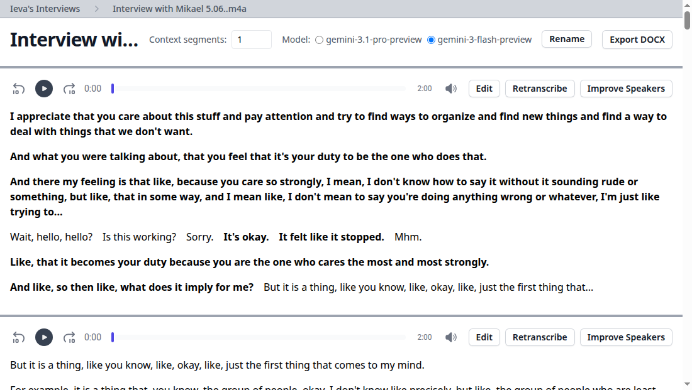

# Slop

Slop is a small web app for transcribing long spoken interviews with Gemini. It
is built around a practical editing loop rather than a one-shot "upload a file
and hope" workflow: upload audio, transcribe a short slice, inspect and edit it,
carry that transcript forward as context, and repeat until the tape is done.

The project is intentionally plain. FastAPI serves the app, Tagflow renders HTML
from Python control flow, HTMX handles the small form interactions, SQLite keeps
metadata and audio blobs, and ffmpeg normalizes/extracts audio segments.



## How It Works

An uploaded audio file is converted to Ogg Vorbis and stored by content hash in
the blob database. The interview record stores the original filename, total
duration, current transcript position, selected Gemini model, context-window
size, and the list of transcript segments.

Transcription then proceeds in fixed-size segments. When you ask for the next
segment, Slop:

1. Finds the current end position in the interview.
2. Extracts the next audio slice with ffmpeg.
3. Uploads that slice to the Gemini Files API.
4. Adds some already-transcribed previous segments as user/model turns.
5. Asks Gemini for XML containing sentence-level utterances and speaker IDs.
6. Parses the XML into Pydantic models and saves it back to SQLite.

The important bit is step 4. Long interviews often fail because every segment is
treated as a cold start: the model has to guess who is speaking, what names mean,
and what conversational thread it is in. Slop instead makes the current segment
part of a continuing conversation. Previous segment audio plus its corrected
transcript become examples for the next call, so manual fixes can improve later
output instead of staying local to one chunk.

## Why It Is Shaped This Way

The core assumption is that interview transcription is an editorial workflow, not
a batch job. You want a transcript that stays aligned with the audio and remains
easy to correct while the model is still doing useful work.

That leads to a few design choices:

- Short segments keep retries cheap and make failures understandable.
- Cached segment audio avoids paying extraction/upload costs repeatedly.
- Content-addressed blobs make local storage simple and duplicate-safe.
- XML output gives the model a narrow contract that is easy to parse.
- Speaker repair is a separate action, because diarization mistakes are common
  and often easier to fix with a hint than by retranscribing everything.
- DOCX export is downstream of the edited transcript, not the raw model output.

## Main Pieces

- `src/slop/transcribe.py` is the web app: upload, player, segment views,
  retranscription, speaker changes, inline editing, model selection, and DOCX
  export.
- `src/slop/sndprompt.py` owns the audio-to-Gemini prompting flow, XML parsing,
  segment extraction, and speaker-identification repair.
- `src/slop/gemini.py` is a typed Gemini REST client for content generation and
  file uploads.
- `src/slop/models.py` defines the Pydantic interview model plus small SQLite
  stores for JSON records and binary blobs.
- `src/slop/views.py` contains reusable UI fragments.

## Operating Model

Slop expects a `GOOGLE_API_KEY`, a writable data directory, Python 3.13, and
ffmpeg. The data directory is controlled by `IEVA_DATA` and defaults to `/data`.

The usual local run shape is:

```sh
IEVA_DATA=./data GOOGLE_API_KEY=... uv run hypercorn slop.transcribe:app
```

An intelligent setup agent should mostly just make sure those pieces exist,
choose a sensible data directory, and run the app under a process manager or
container if this is not a throwaway local session.

## Current Status

This is working software, but it is still a compact personal tool rather than a
polished product. Expect the API surface to move. The useful ideas are the
segment-by-segment correction loop, the transcript-as-context prompting pattern,
and the deliberately simple storage model.
